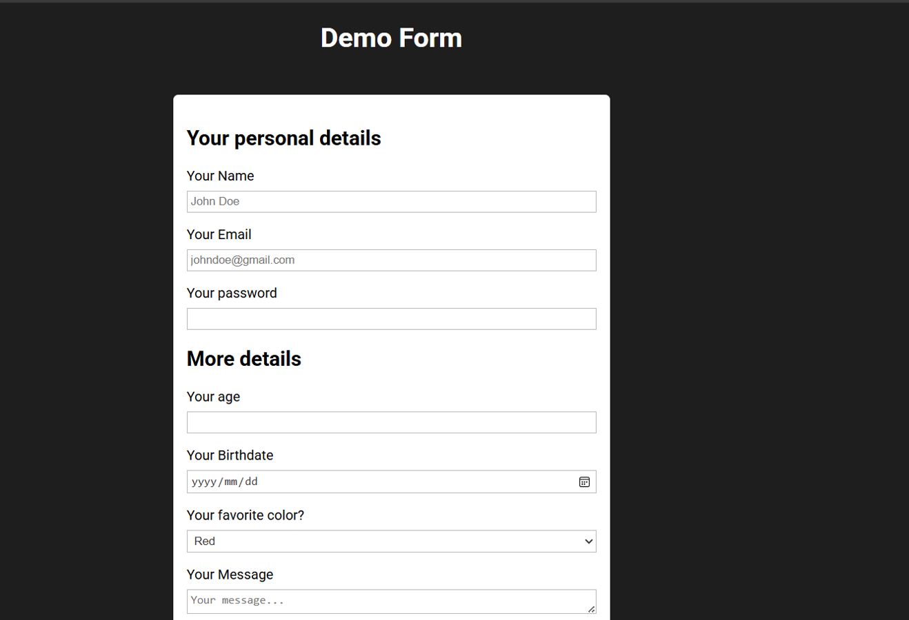
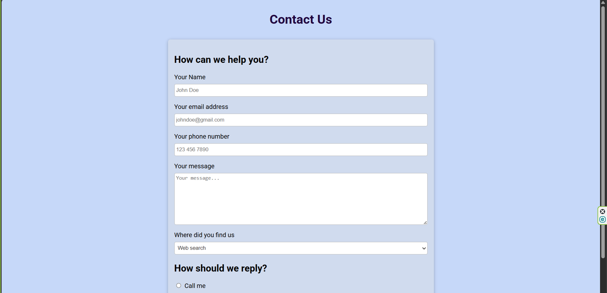

# HTML Forms

## Details

## Screenshots
<table>
  <tr>
    <th>Page Name</th>
    <th>Screenshot</th>
  </tr>
  <tr>
    <td><strong>Basic form</strong></td>
    <td></td>
  </tr>
   <tr>
    <td><strong>Challenge form</strong></td>
    <td></td>
  </tr>
  
 
</table>
